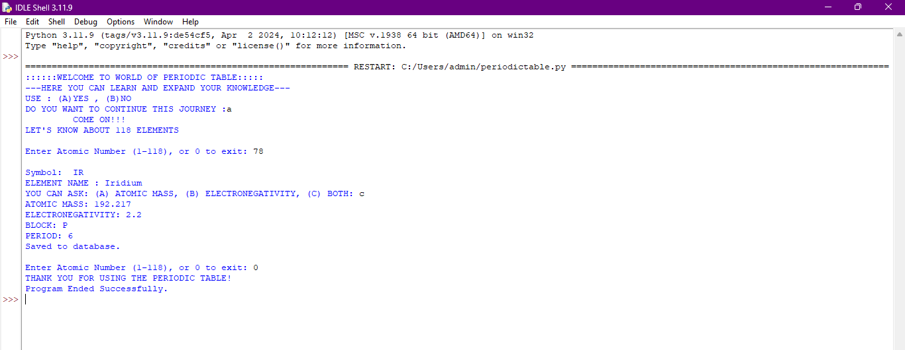

🧪 PERIODIC TABLE PROJECT
## 📌Description
  This is a Python-based command line application that allows users to explore periodic table elements using atomic numbers.
  The program also stores user search history using a SQLite database.

## 🚀Features
   - Search element by atomic number(1- 118)
   - Displays:
       1 Element Name
       2 Symbol
       3 Atomic Mass
       4 Electronegativity
       5 Block
       6 Period
  - Saves data into database

## 🖼️Outout Preview

## 🔨Technologies Used
    - Python
    - SQLite

## ▶️How to Run?????
   Python periodictable.py
